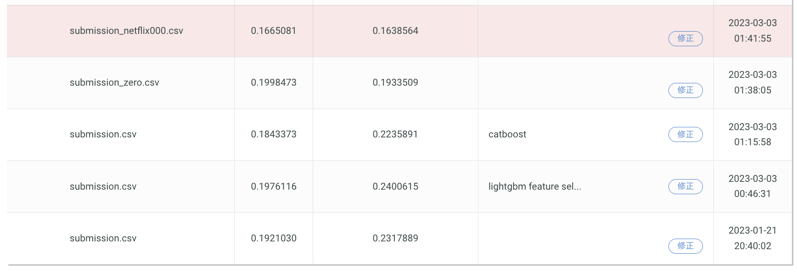

# SIGANTE「ブルーカーボン・ダイナミクスを可視化せよ！」

最終評価 14 位の取り組みとコード



## やったこと

最初の 4 回で、次のモデルを提出し順位表でのスコアを確認しました。

1. 与えられたほぼ全ての特徴量を用いて、LightGBM で学習・予測（0.1921030）
1. 1 のモデルの特徴量重要度上位28件を用いて、LightGBM で学習・予測（0.1976116）
1. 1 のモデルの特徴量重要度上位28件を用いて、CatBoost で学習・予測（0.1843373）
1. 全て 0 で予測（0.1998473）

手元での交差検証の結果と順位表でのスコアが一貫しない点、評価指標が回帰で不確実性が大きい点、全て 0 で予測した結果と機械学習のアプローチに大差がない点などを理由に、ある程度信頼できそうな提出をしてコンペを終えることに決めました。

評価指標が RMSE だったため、最終提出には Linear Quiz Blending を使いました。簡単な説明は、以下ブログ記事をご参照ください。  
https://upura.hatenablog.com/entry/2020/03/01/190400 

## ソースコード

```bash
cd src
python run_lgbm_baseline.py
python run_lgbm_feat_select.py
python run_cat_feat_select.py
python run_all_zero.py
python run_ensemble.py
```
